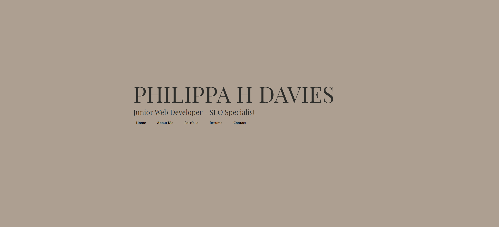

# React + Vite 

# Table of Contents
- [Description](#description)
- [Installation](#installation)
- [Usage](#usage)
- [License](#license)
- [Contribution](#contribution)
- [Tests](#test)
- [Questions](#questions)

## Description:
This application is a portfolio for me to showcase my work and put myself out there as a developer. It features a home page, an about page, a portfolio page, my resume and a contact page.

## Installation:

To visit the deployed app, please click here:

If you'd like to install the application, you'll need to ensure you have a Terminator emulator Software installed (such as Terminal for Mac, or Bash for Windows). Simply git clone it into your preferred folder! For more details on set-up, please see the Usage section below.

## Usage:
If you are just visiting the deployed application, you can navigate the app via the navigation bar.

**If you are installing this application to run on your local host, you'll need to follow these instructions**:

After cloning this code, you will need to navigate to the folder in your chosen terminal application and run two commands:
- npm i
- npm run dev

After this, a port will open, and you'll be able to use the application by navigating to the port in your browser. You'll then be able to access the application as normal.

## License:
The license for this project is: No_License.
This project has not been listed under a license.

## Contribution:
N/A

## Test:
N/A

## Questions
My GitHub username is p-h-davies, and you can view my profile here: https://github.com/p-h-davies/.
 
To get in contact with me, please email me here: philippadavies603@gmail.com.

